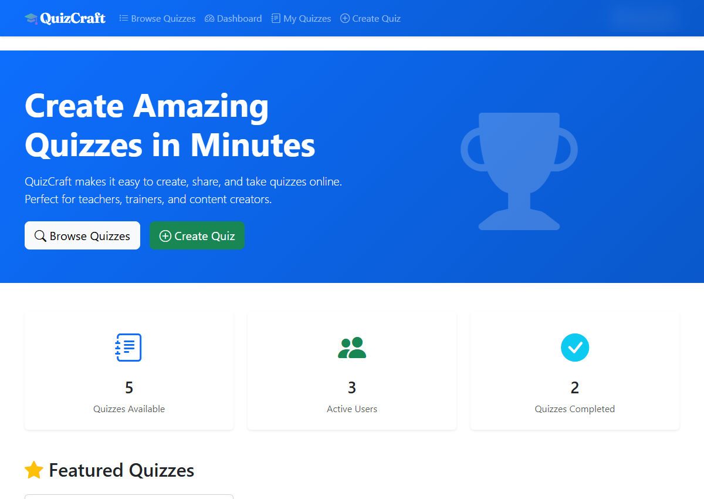

# QuizCraft — Free Edition

**A SaaS quiz-taking platform for education, training, and content creators.**

Built with Django and Bootstrap.

> This is the **Free Edition** — focused on quiz taking only.
> Quiz creation, advanced billing, and commercial usage rights are exclusive to **QuizCraft Pro**.

---

## What's Included (Free Edition)

- Browse and take public quizzes
- Auto-grading for multiple choice, true/false, and short answer questions
- Timed quizzes
- User dashboard with attempt history and results
- Multi-language support (EN, NL, ES, DE, FR)
- Dark mode
- Fully responsive design

## Pro Features (not included here)

- Full quiz creation and management
- Stripe subscription billing
- Advanced subscription tiers
- Commercial deployment license

For Pro features and licensing, see [LICENSE.md](LICENSE.md) and visit [https://djangozen.com/saas/product/quizcraft/](https://djangozen.com/saas/product/quizcraft/)

---

## Quick Start

### Prerequisites
- Python 3.12+

### Installation

1. Clone the repository
2. Create and activate a virtual environment
3. Install dependencies: `pip install -r requirements.txt`
4. Copy `.env.example` to `.env` and configure your settings
5. Run migrations: `python manage.py migrate`
6. Create a superuser: `python manage.py createsuperuser`
7. Start the development server: `python manage.py runserver`

Visit `http://localhost:8000` to get started.

---

## License

QuizCraft Free Edition is released under a **source-available license**.
It is free for personal evaluation, learning, and non-commercial self-hosting.

**Commercial use, SaaS hosting, or redistribution requires a paid commercial license.**

See [LICENSE.md](LICENSE.md) for full terms.

**Commercial pricing starts at €249.**

Buy a license: [https://djangozen.com/saas/product/quizcraft/](https://djangozen.com/saas/product/quizcraft/)

---

## Version
**Current Version:** 1.0.0
**Status:** Production Ready (Free Edition)
